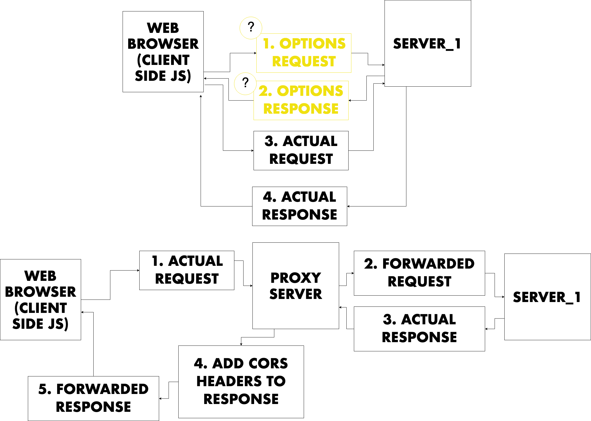

# CORS

* Define Origin
* Define Resource
* Define CORS
  * Cross Origin
  * Resource
  * Sharing
* Setup client for Reddit API request with CORS Error...
  * http://localhost:3014/
  * https://tmi.twitch.tv/group/user/codinggarden/chatters
* Fix CORS error from the server (if you are in control)
* See if server supports JSONP
  * JSON with padding...
* Fix CORS error from the web client (if you are not in control of the server)
  * CORS Proxy
    * Hosted...
    * Write your own...

